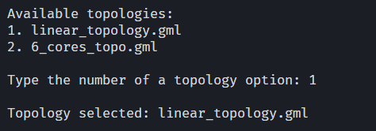
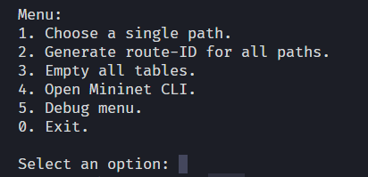
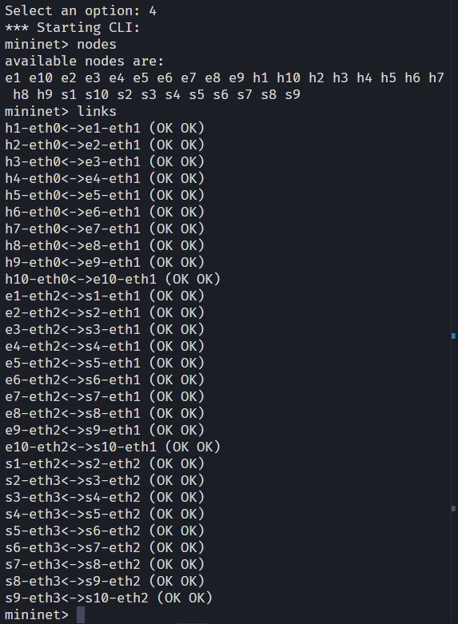
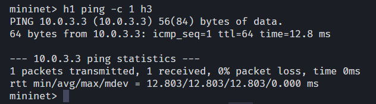
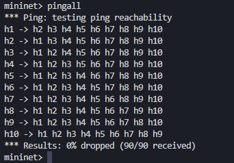
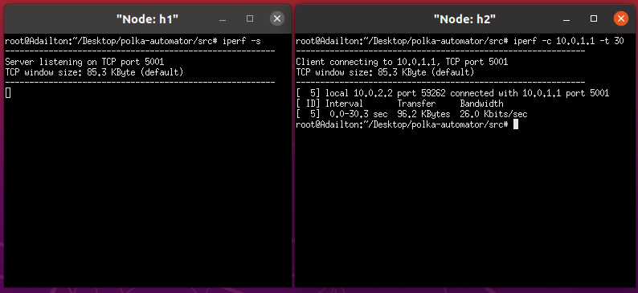
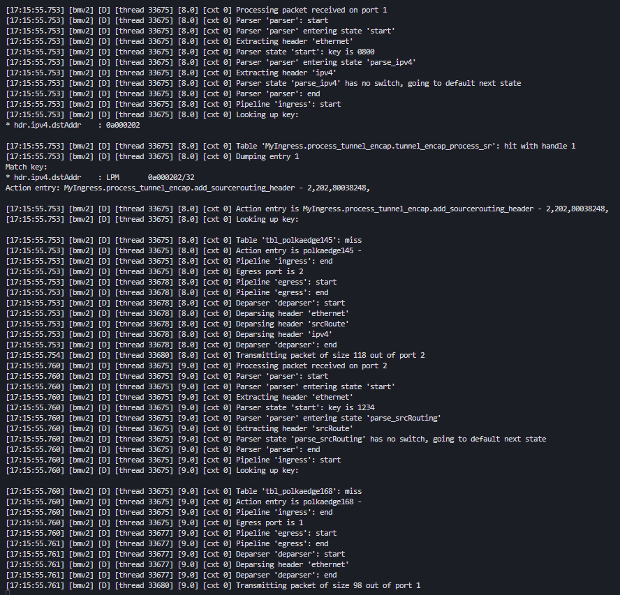

# Automation for PolKA Processes

This repository contains scripts and tools to automate tasks related to **PolKA** (Polynomial Key-based Architecture for Source Routing), using **Mininet** and **NetworkX**.

## About the Project

The main goal of this project is to simplify the manipulation of network topologies, as well as the simulation and testing of the PolKA architecture. It aims to reduce manual work when setting up test environments, routing logic, and other network-related operations.

## How To Use

### Creating the Virtual Machine

1. Download the Ubuntu 20.04 image:

    Available at: [Ubuntu website](https://releases.ubuntu.com/20.04.6/?_ga=2.149898549.2084151835.1707729318-1126754318.1683186906)

1. Use VirtualBox or VMware to create the VM.

### Installing PolKA dependencies

1. Update the system:
    ```bash
    $ sudo apt update && sudo apt dist-upgrade -y
    ```
1. Clean up unnecessary packages and cache:
    ```bash
    $ sudo apt clean && sudo apt autoremove -y
    ```
1. Reboot:
    ```bash
    $ sudo reboot
    ```
1. Install Mininet:
    ```bash
    $ sudo apt install mininet
    ```
1. Install Mininet Wifi:
    ```bash
    $ git clone https://github.com/intrig-unicamp/mininet-wifi
    $ cd mininet-wifi
    $ sudo util/install.sh -Wlnfv
    ```
1. Install P4C (the P4 language compiler):
    ```bash
    $ source /etc/lsb-release
    $ sudo apt install curl
    $ echo "deb http://download.opensuse.org/repositories/home:/p4lang/xUbuntu_${DISTRIB_RELEASE}/ /" | sudo tee /etc/apt/sources.list.d/home:p4lang.list
    ```
    ```bash
    $ curl -fsSL https://download.opensuse.org/repositories/home:p4lang/xUbuntu_${DISTRIB_RELEASE}/Release.key | gpg --dearmor 
    $ sudo tee /etc/apt/trusted.gpg.d/home_p4lang.gpg > /dev/null
    ```
    ```bash
    $ sudo apt-get update
    $ sudo apt install p4lang-p4c
    ```
1. Install PolKA:
    ```bash
    $ pip install polka-routing
    ```

### Installing code dependencies

1. Install code requirements:
    ```bash
    $ pip install -r requirements.txt
    ```

### Using the code

1. Navigate to the PolKA folder and run `make`:
    ```bash
    $ cd polka-automator/polka
    ```
    ```bash
    $ make
    ```

1. Run main in the src folder:
    ```bash
    $ sudo -E python3 main.py
    ```

1. Follow the terminal prompts to interact.
    

## Usage Examples and Results

### Menu

The following image shows the first menu displayed when running main.py.


The second image shows the next menu, where users can select different options to configure the topology, run tests, and interact with the PolKA environment after choosing the GML file.


### Mininet Topology

The output below lists all nodes and links created in the emulated topology. This confirms that the network has been successfully instantiated according to the chosen configuration.


### Ping Tests

The following screenshot shows the result of a ping command executed between two specific hosts. The successful replies confirm that point-to-point connectivity is working as expected.


The image below presents the output of the pingall command, where every host in the topology attempts to reach all others. The results confirm end-to-end connectivity across the entire network.


### Iperf Test

The image below shows the results of an iperf test performed between two hosts. This measurement demonstrates the available bandwidth and verifies end-to-end data transmission performance.


### P4 Switch Log

The following log excerpt comes from a P4 software switch running inside the emulation. It shows the installation and execution of forwarding rules, confirming that PolKA source routing is being applied as expected.
